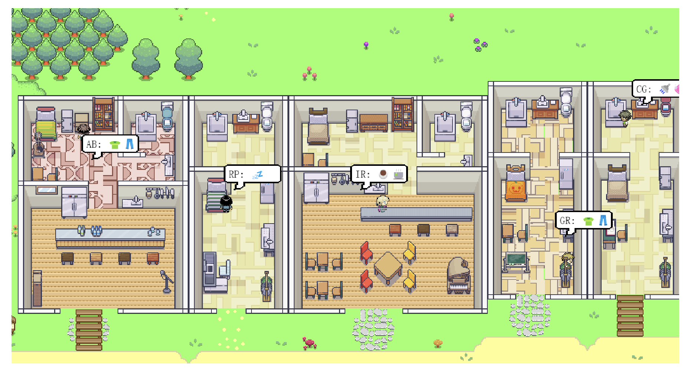

# Fiction Generator: Attempts for fictional content generation

Edited by Muyang Li, Qinwen Ge

## Background & Ideas

**This is a pre-computed replay of a simulation that accompanies the paper entitled "Generative Agents: Interactive Simulacra of Human Behavior." It is for demonstration purposes only.**

Existed ai story generator:

- Novel AI
- ShortlyAi
- StoryWriter
- Holoai

## Our methods

### Design with ChatGPT API

#### Overview

In our Fiction Generator project, we leverage OpenAI's GPT API to enable the generation of detailed and creative fictional content. This integration is central to transforming user inputs on various aspects of fiction – such as background, characters, and plot – into rich narrative elements.

#### Implementation Process

##### API Integration

##### Function Design

- **Centralized Function for Description Generation**: Instead of creating multiple functions for different aspects of fiction generation, we designed a versatile function dynamically constructs prompts for the GPT model based on user inputs across various categories (like world type, character identity, plot development, etc.).
- **Iterative Refinement Function**: To enhance the depth and quality of the generated content, we implemented an function iteratively expands on the narrative, adding layers of detail with each iteration.
- **Combination and Refinement of Descriptions**: In the end, we aggregate the outputs from different categories and refines them collectively, ensuring a more cohesive and comprehensive narrative.

##### Gradio Interface and GPT-3 Interaction

- **Tab-Based User Interface**: Our Gradio interface is organized into tabs corresponding to different elements of storytelling. This design facilitates user interaction and organizes the input process logically.
- **Dynamic Prompt Construction**: Our fiction generator can construct prompts tailored to the user's inputs, which are then passed to the GPT model for content generation.
- **Adaptive Output Generation**: The integration of GPT with our function allows for flexible and context-sensitive generation of narrative content, adapting to the diverse and creative inputs provided by users.

### Design with Chatgpt builder

### Design with finetuned model

Alpaca-Lora: https://github.com/tloen/alpaca-lora

## Demo

## Limitations and Critical Analysis

## Resources

**Models: mpt-7b-storywriter :Example Epilogue**

The full text of the The Great Gatsby (67873 tokens) was fed to the model, followed by the text "EPILOGUE"

TheRealFitzgerald233:

...

So we beat on, boats against the current, borne back ceaselessly into the past

EPILOGUE

MPT-7B-StoryWriter:

I have lived so long in the shadow of this dream that I may never see the bright sunlight of reality. I may look up some morning and find that I am six feet under, and that Gatsby, who gave me the dream and everything else, will have vanished behind me.

And so it was. I had hardly crossed the threshold of the old world when my eye caught the headlines of a newspaper, and I knew at once that my dream was over. I knew that Gatsby was dead.

And I knew that day that I didn't love her.

That night I took the last train for West Egg, and when I reached home I went directly to my attic and brought down all Gatsby's letters.

I have sorted them by date and placed them in the order in which they were written. They are very few in number.

They are dated between April of nineteen eighteen and January of nineteen nineteen, and the last one I have here is the one that told me he was dead.

There is something in that last letter that frightens me. It is the sense of a finality, of a completeness. I never heard of him after that, and I was glad.

But a few months ago I read somewhere that he had been seen in New York. He had become a great man.

And I knew that he had not changed at all.

**Model Description**
The architecture is a modification of a standard decoder-only transformer.

The model has been modified from a standard transformer in the following ways:

- It uses FlashAttention
- It uses ALiBi (Attention with Linear Biases) and does not use positional embeddings
- It does not use biases

**Datasets:**

- **dell-research-harvard/AmericanStories**
- **the_pile_books3 (Unavailable now due to reported copyright infringement)**

## Links

- https://reverie.herokuapp.com/arXiv_Demo/
- https://github.com/tloen/alpaca-lora
- https://huggingface.co/datasets/the_pile_books3
- https://huggingface.co/mosaicml/mpt-7b-storywriter
- https://huggingface.co/datasets/dell-research-harvard/AmericanStories

## Reference

- https://arxiv.org/abs/2304.03442
- https://platform.openai.com/docs/introduction
